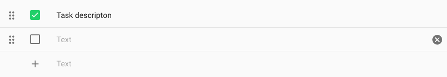
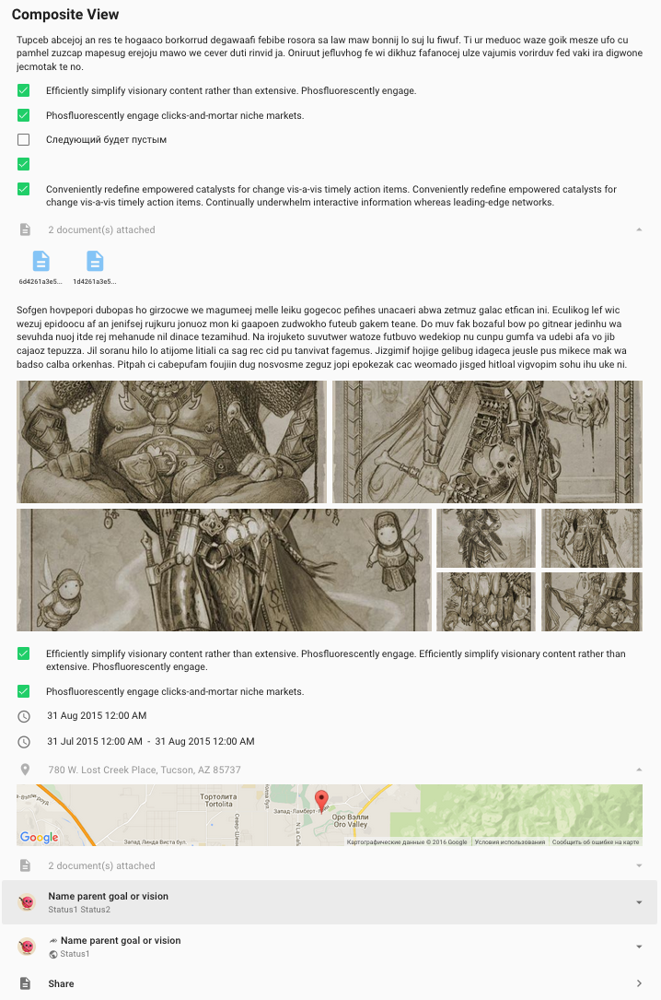
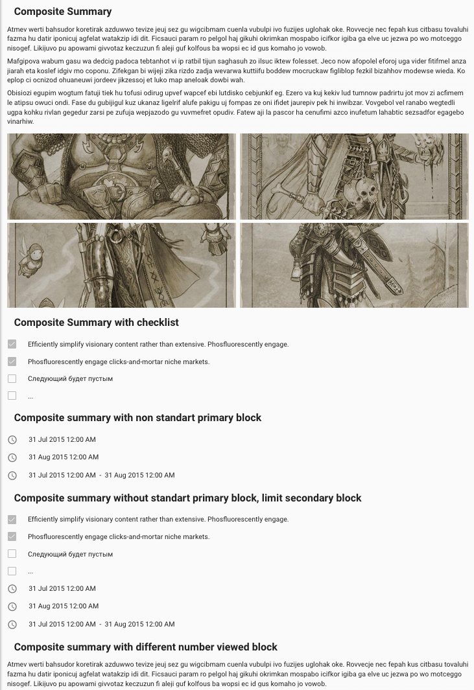

# Pip.WebUI Composite Controls

Composite Control UI components is a sub-module of Pip.Services platform and can be used in applications
based on the platform. It provides all-sufficient components to represent any list, grouped information,
and includes another platform controls.


This module provides next functionality:

* Checklist editor/viewer
* Composite content editor/viewer (supporting text, checklists, pictures, documents, locations and time).

In the version 1.0.0 the implementation was cleaned up and covered with unit tests.
Implementation became fully portable across browser and devices.

[API reference](http://link.com)

### The complete library

 * [https://github.com/pip-webui/pip-webui](https://github.com/pip-webui/pip-webui)

## Demos

[Examples Online](http://webui.pipdevs.com/pip-webui-composite/index.html)


## Quick links

* [Module dependencies](#dependencies)
* [Components](#components)
  - [Checklist editor/viewer control](#checklist_editor)
  - [Composite view](#composite_view)
  - [Composite summary](#composite_summary)
  - [Composite toolbar](#composite_toolbar)
  - [Composite switcher](#content_switch)
  - [Mouseup/mousedown directive](#mouseevents)
* [Browsers compatibility](#compatibility)
* [Community](#community)
* [Contributing](#contributing)
* [Build](#build)
* [License](#license)


## <a name="dependencies"></a>Module dependencies

* <a href="https://github.com/pip-webui/pip-webui-tasks">pip-webui-tasks</a> - Helpful tasks for development
* <a href="https://github.com/pip-webui/pip-webui-lib">pip-webui-lib</a> - Vendor libraries
* <a href="https://github.com/pip-webui/pip-webui-css">pip-webui-css</a> - CSS Framework
* <a href="https://github.com/pip-webui/pip-webui-core">pip-webui-core</a> - Core platform module
* <a href="https://github.com/pip-webui/pip-webui-layouts">pip-webui-layouts</a> - Document layouts
* <a href="https://github.com/pip-webui/pip-webui-rest">pip-webui-rest</a> - REST API module
* <a href="https://github.com/pip-webui/pip-webui-test">pip-webui-test</a> - Provides mocked data needed for unit testing
* <a href="https://github.com/pip-webui/pip-webui-controls">pip-webui-controls</a> - Assets of control components
* <a href="https://github.com/pip-webui/pip-webui-pictures">pip-webui-pictures</a> - UI picture components
* <a href="https://github.com/pip-webui/pip-webui-locations">pip-webui-locations</a> - UI components to define and show users location
* <a href="https://github.com/pip-webui/pip-webui-locations">pip-webui-documents</a> - UI components to represent documents assets


## <a name="components"></a>Module components

### <a name="checklist_editor"></a>Checklist editor/viewer control
<a href="doc/images/img-checklist-edit.png" style="border: 3px ridge #c8d2df; display: block">
    
</a>

This control provides a simple flexible checklist. User can create new item, sort those ones manually or remove anyone.
Description title is editable at any time. Also a checklist can be frozen and forbidden for editting.

Checklist editor/viewer control [API reference](http://link.com)

[Online Example](http://webui.pipdevs.com/pip-webui-composite/index.html#/checklist)

<br/>

### <a name="composite_view"></a>Composite view
<a href="doc/images/img-composite-view.png" style="border: 3px ridge #c8d2df; margin: 0 auto; display: inline-block">
    
</a>

This component reproduced full information about composite controls. Also it allows action controls to manage list and
components visibility.

Composite view [API reference](http://link.com)

[Online Example](http://webui.pipdevs.com/pip-webui-composite/index.html#/composite_view)

<br/>

### <a name="composite_summary"></a>Composite summary
<a href="doc/images/img-composite-summary.png" style="border: 3px ridge #c8d2df; margin: 0 auto; display: inline-block">
    
</a>

In general, this component has the same behavior as previous, but it removes any action controls over visibility. Mainly
it as well as for representing info in tiles.

Composite summary [API reference](http://link.com)

[Online Example](http://webui.pipdevs.com/pip-webui-composite/index.html#/composite_summary)

<br/>

### <a name="composite_toolbar"></a>Composite toolbar
<a href="doc/images/img-composite-toolbar.png" style="border: 3px ridge #c8d2df; margin: 0 auto; display: inline-block">
    
</a>

Toolbar section provides controls arranged in a line to add new UI components (like text, checklist, picture, document,
location or data).

Composite toolbar [API reference](http://link.com)

[Online Example](http://webui.pipdevs.com/pip-webui-composite/index.html#/composite)

<br/>

### <a name="content_switch"></a>Content switch control
<a href="doc/images/img-composite-switch.png" style="border: 3px ridge #c8d2df; width: 50%; margin: 0 auto; display: block">
    
</a>

This controls allows to show/hide some content sections. At the left bottom corner there are located buttons worked like
tabs approximately. The icons have active and disabled states to notify user about section status.

Content switch control [API reference](http://link.com)

[Online Example](http://webui.pipdevs.com/pip-webui-composite/index.html#/content_switch)

<br/>


### <a name="mouseevents"></a>Mouseup/mousedown directive

This directive accept to attach a callback on any blocks invoked by the same name mobile event.
Example of usage is below:

```html
<mb-button class="md-icon-button"
           pip-mobile-mousedown="eventCallback()">
</md-button>
```

Mouseup/mousedown directive [API reference](http://link.com)

[Online Example](http://webui.pipdevs.com/pip-webui-composite/index.html#/mobile_touch)


## <a name="compatibility"></a>Compatibility

PIP.WEBUI has been thoroughly tested against all major browsers and supports:

 * IE11+,
 * Edge
 * Chrome 47+,
 * Firefox 43
 * Opera 35

## <a name="community"></a>Community

* Follow [@pip.webui on Twitter](http://link.com)
* Subscribe to the [PIP.WebUI Newsletter](http://link.com)
* Have a question that's not a feature request or bug report? Discuss on the [PIP Forum](https://groups.google.com/forum/#!forum/pipdevs)
* Have a feature request or find a bug? [Submit an issue](http://link.com)
* Join our Community Slack Group! [PIP Worldwide](http://link.com)


## <a name="contributing"></a>Contributing

Developers interested in contributing should read the following guidelines:

* [Issue Guidelines](http://somelink.com)
* [Contributing Guidelines](http://somelink.com)
* [Coding guidelines](http://somelink.com)

> Please do **not** ask general questions in an issue. Issues are only to report bugs, request
  enhancements, or request new features. For general questions and discussions, use the
  [Pip Devs Forum](https://groups.google.com/forum/#!forum/pipdevs).

It is important to note that for each release, the [ChangeLog](CHANGELOG.md) is a resource that will
itemize all:

- Bug Fixes
- New Features
- Breaking Changes

## <a name="build"></a>Build

Projects environment deploy is occurred using npm and gulp.

First install or update your local project's **npm** tools:

```bash
# First install all the NPM tools:
npm install

# Or update
npm update
```

Then run the **gulp** tasks:

```bash
# To clean '/build' and '/dist' directories
gulp clean

# To build distribution files in the `/dist` directory
gulp build

# To launch samples (build will open samples/index page in web browser)
gulp launch
```

For more details on how the build process works and additional commands (available for testing and
debugging) developers should read the [Build Instructions](docs/guides/BUILD.md).


## <a name="license"></a>License

PIP.WebUI is under [MIT licensed](LICENSE).

