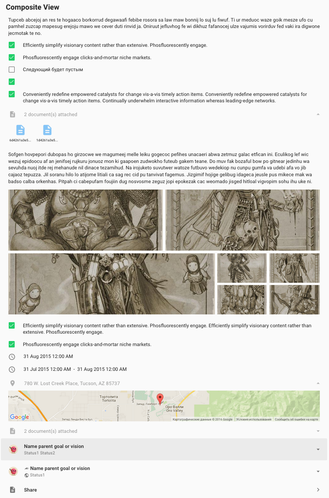
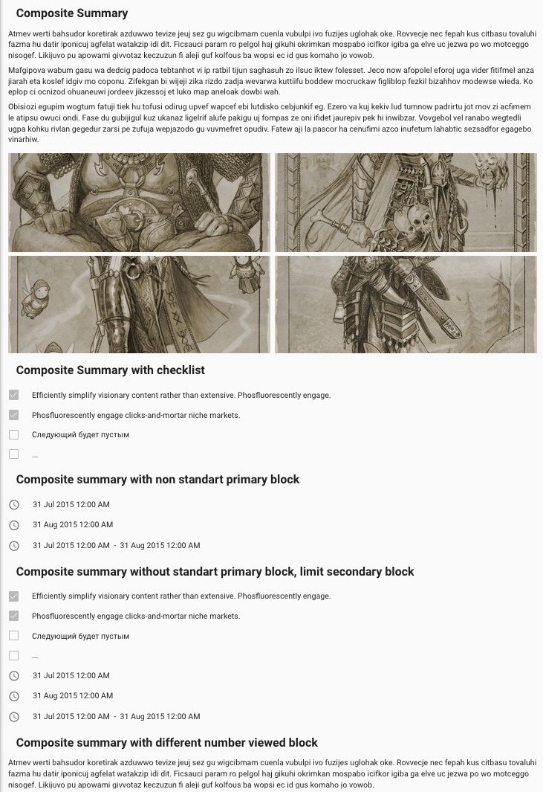
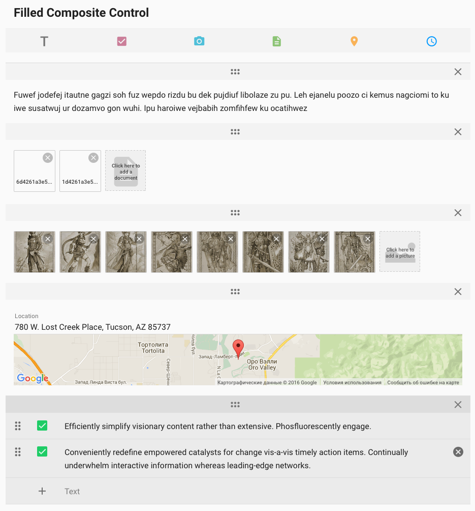
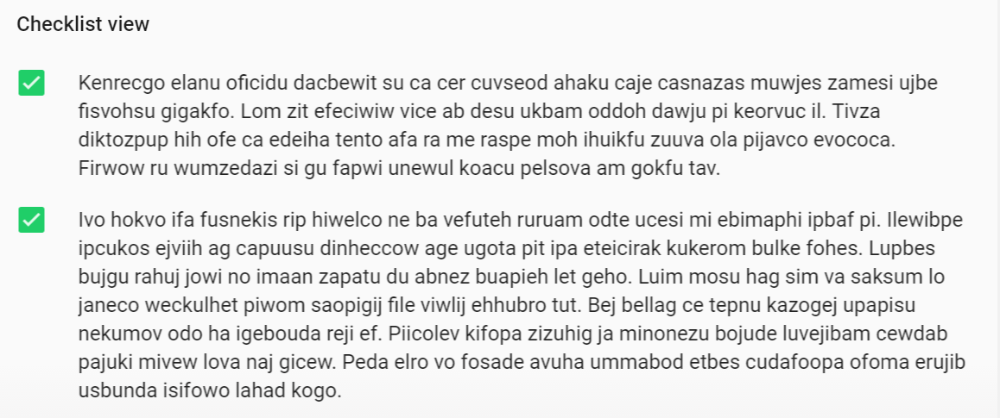
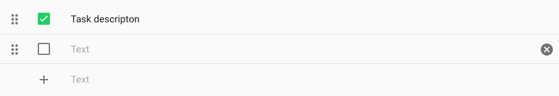
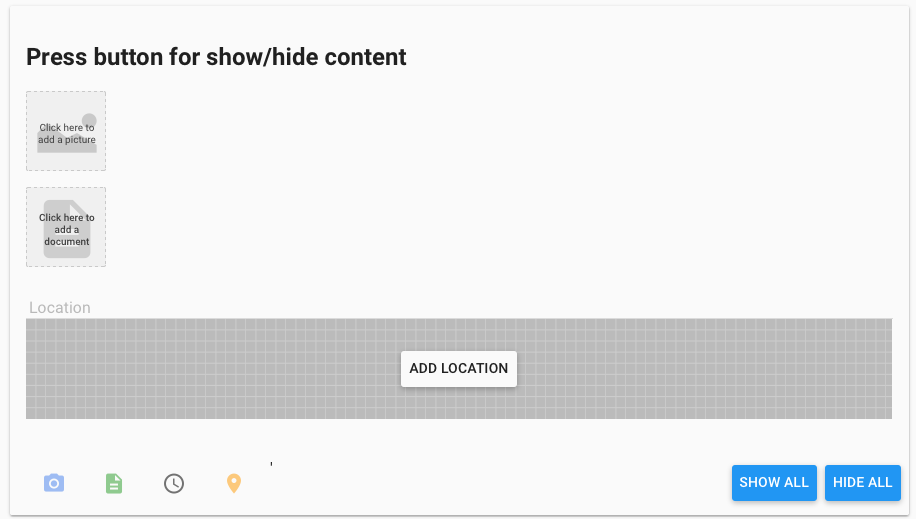

# Pip.WebUI.Composite User's Guide

## <a name="contents"></a> Contents
- [Installing](#install)
- [pip-composite-view](#composite_view)
- [pip-composite-summary](#composite_summary)
- [pip-composite-edit](#composite_edit)
- [pip-checklist-view](#checklist_view)
- [pip-checklist-edit](#checklist_edit)
- [pip-content-switch](#content_switch)
- [Questions and bugs](#issues)


## <a name="install"></a> Installing

Add dependency to **pip-webui** into your **bower.json** or **package.json** file depending what you use.
```javascript
"dependencies": {
  ...
  "pip-webui": "*"
  ...
}
```

Alternatively you can install **pip-webui** manually using **bower**:
```bash
bower install pip-webui
```

or install it using **npm**:
```bash
npm install pip-webui
```

Include **pip-webui** files into your web application.
```html
<link rel="stylesheet" href=".../pip-webui-lib.min.css"/>
<link rel="stylesheet" href=".../pip-webui.min.css"/>
...
<script src=".../pip-webui-lib.min.js"></script>
<script src=".../pip-webui.min.js"></script>
```

Register **pipComposite** module in angular module dependencies.
```javascript
angular.module('myApp',[..., 'pipComposite']);
```

## <a name="composite_view"></a> pip-composite-view

**pip-composite-view** controls shows read-only version of composite content. The content structured as blocks with hypertext, images, documents, locations, checklists. The only allowed action is to check/uncheck item in checklists.

This directive relies on **files** operation from standard REST API.
[Go to Pip.WebUI.Rest Users's Guide](https://github.com/pip-webui/pip-webui-rest/blob/master/doc/UsersGuide.md)

### Usage
```html
    <pip-composite-view pip-contents="compositeView"
                        ng-disabled="isDisabled()"
                        pip-rebind="true">
    </pip-composite-view>
```



### Attributes
* **pip-contents** - content object 
* **pip-rebind** - updating pip-content field


## <a name="composite_summary"></a> pip-composite-summary

This is a shorter version of **pip-composite-view** control for previews and tiles. It shows only first 3 blocks. Text and lists are truncated to keep it concise. **pip-composite-summary** does not support check/uncheck of checklist items.

This directive relies on **files** operation from standard REST API.
[Go to Pip.WebUI.Rest Users's Guide](https://github.com/pip-webui/pip-webui-rest/blob/master/doc/UsersGuide.md)

### Usage
```html
<pip-composite-summary pip-contents="compositeSummarySecondary"
                       pip-secondary-block-types="['documents', 'time', 'location']"
                       pip-text-size="4"
                       pip-checklist-size="3"
                       pip-rebind="true">
</pip-composite-summary>
```



### Attributes
* **pip-contents** - content object 
* **pip-rebind** - updating pip-content field
* **pip-text-size** - max count lines of text objects 
* **pip-checklist-size** - max count checkbox items in one object 
* **pip-secondary-block-types** - array types on secondary blocks


## <a name="composite_edit"></a> pip-composite-edit

**pip-composite-edit** control allows to construct complex content using blocks with hypertext, images, documents, locations and checklists. Blocks can be added, moved up or down or removed. Hypertext is entered using popular markdown format.

This directive relies on **files** operation from standard REST API.
[Go to Pip.WebUI.Rest Users's Guide](https://github.com/pip-webui/pip-webui-rest/blob/master/doc/UsersGuide.md)

### Usage
```html
<pip-composite-edit pip-contents="compositeView"
                    pip-scroll-container=".composite-scroll"
                    pip-rebind="true"
                    pip-composite-placeholder="'DESCRIBE_THIS'"
                    pip-added-content="true"
                    pip-composite-id="2">
</pip-composite-edit>
```



### Attributes
* **pip-contents** - content object 
* **pip-rebind** - updating pip-content field
* **pip-scroll-container** - class in scroll container
* **pip-added-content** - possibility add content 
* **pip-composite-id** - id of composite control


## <a name="checklist_view"></a> pip-checklist-view

**pip-checklist-view** control shows read-only version of checklist and only allows to check/uncheck items. This control is integrated inside **pip-composite-view** and **pip-composite-summary**, but it also can be used independently.

### Usage
```html
<pip-checklist-view pip-options="viewChecklist"
                    ng-disabled="emptyChecklistViewDisabled"
                    pip-rebind="true">
</pip-checklist-view>

```



### Attributes
* **pip-options** - array content 
* **pip-rebind** - updating pip-options field

## <a name="checklist_edit"></a> pip-checklist-edit

**pip-checklist-edit** control allows to edit checklist with textual items. It allows to append or insert new items, edit them, change their order or remove them. This control is integrated into **pip-composite-edit**, but it can also be used independently.

### Usage
```html
<pip-checklist-edit pip-draggable="true"
                    ng-disabled="isDisabled()"
                    pip-changed="onChange"
                    pip-options="emptyChecklist"
                    pip-rebind="emptyChecklistRebind">
</pip-checklist-edit>
```



### Attributes
* **pip-options** - array texts for checkboxes  
* **pip-rebind** - updating pip-options field
* **pip-changed** - function for updating pip-options 
* **pip-draggable** - possibility drag and drop

## <a name="content_switch"></a> pip-content-switch

**pip-content-switch** control helps to construct own vesion of a simple composite content. By clicking a button user can add or remove text, images, files or location elements.

### Usage
```html
 <pip-content-switch pip-parent-element-name="'.sample-output'"> </pip-content-switch>
```



### Attributes
* **pip-parent-element-name** - parent element class

## <a name="issues"></a> Questions and bugs

If you have any questions regarding the module, you can ask them using our 
[discussion forum](https://groups.google.com/forum/#!forum/pip-webui).

Bugs related to this module can be reported using [github issues](https://github.com/pip-webui/pip-webui-composite/issues).
